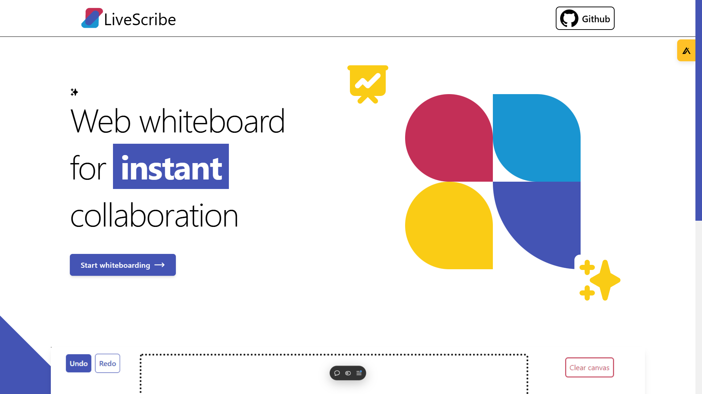
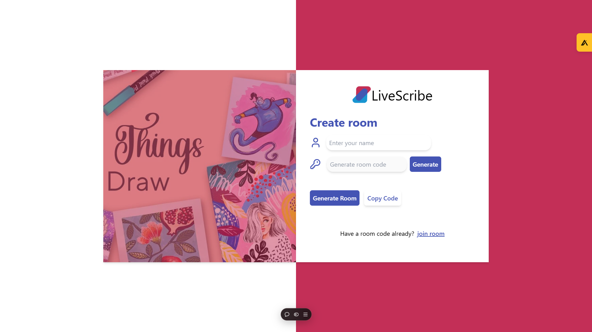
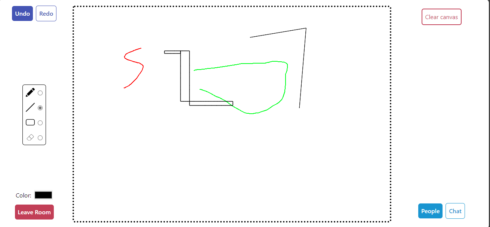
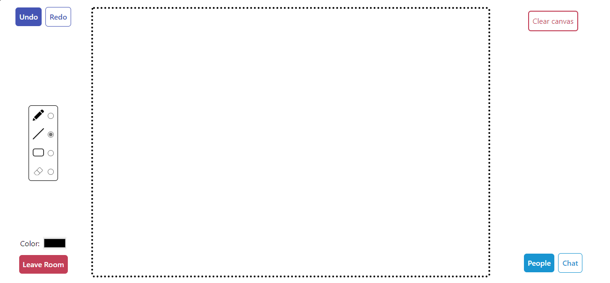
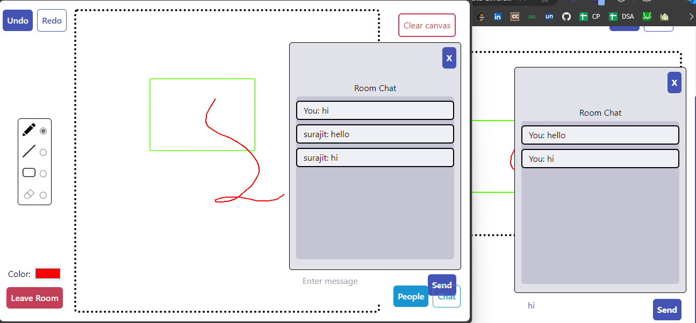

## About The Project

LiveScribe is a real-time collaborative whiteboarding web application, allowing multiple users to collaboratively create art using a shared canvas. Built with the MERN stack and Socket.IO, LiveScribe provides a seamless and engaging collaborative drawing experience.

## Features

- Real-time collaboration on a shared canvas.
- Create and join rooms for collaborative drawing sessions.
- Group chat feature inside a room.
- MERN stack for robust and scalable architecture.
- Socket.IO for efficient real-time communication.

## Tech Stack


## Demo

### Landing Page


### Create/Join Room Page


### Whiteboard with realtime collaboration and Room Chat features





## Getting Started

Follow these steps to set up and run LiveScribe locally.

### Prerequisites

- Node.js and npm installed on your machine.

### Installation

### Open Terminal

Open cmd or any other terminal you have.
Then run the following commands.

### Clone the repo
   ```sh
   git clone https://github.com/architajain2003/Real_Time_Whiteboard.git
   ```
#### Client

```bash
cd client
npm install
```

#### server
```bash
cd server
npm install
```
### Running Locally

```bash
cd client
npm run dev

cd server
npm run dev
```
